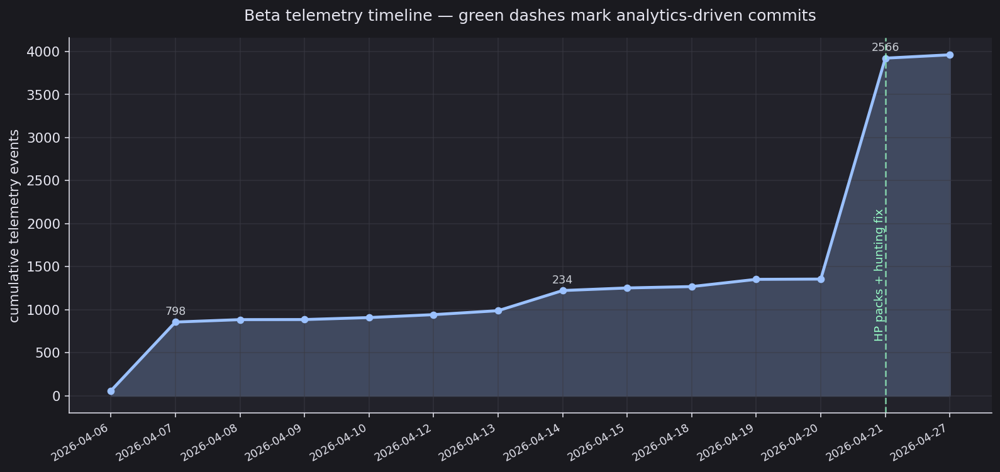
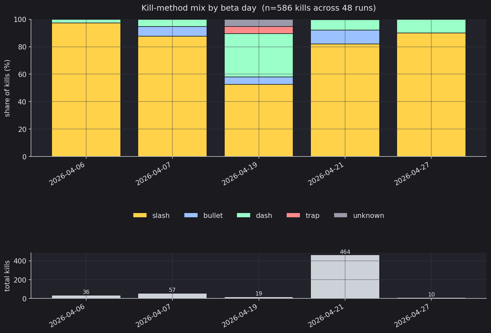
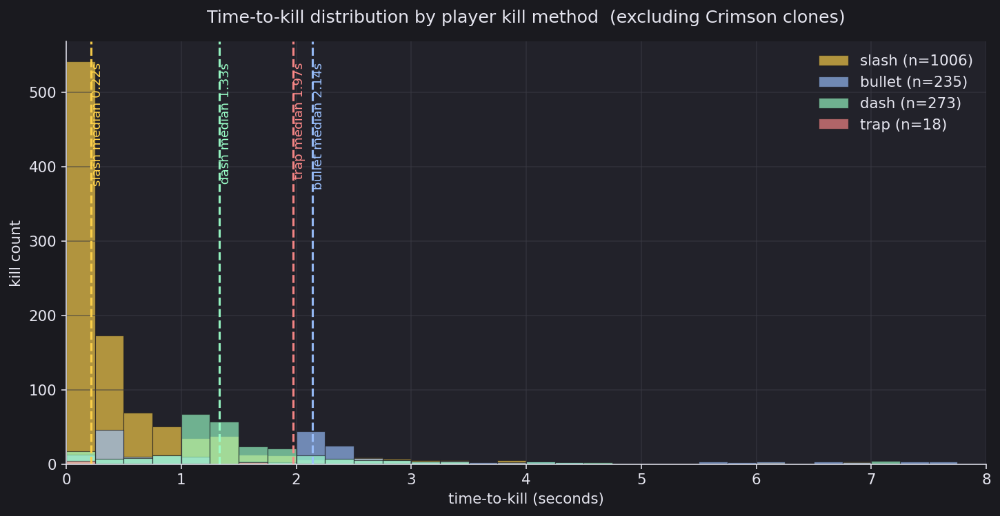
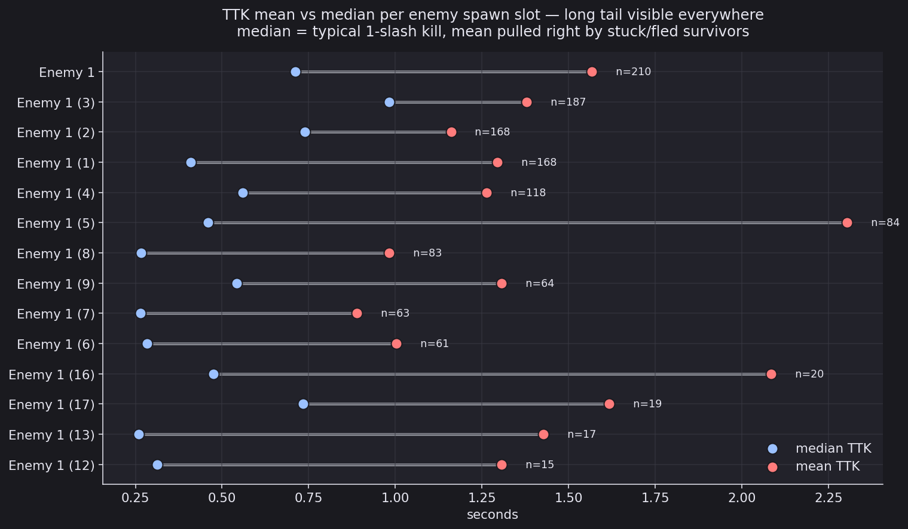
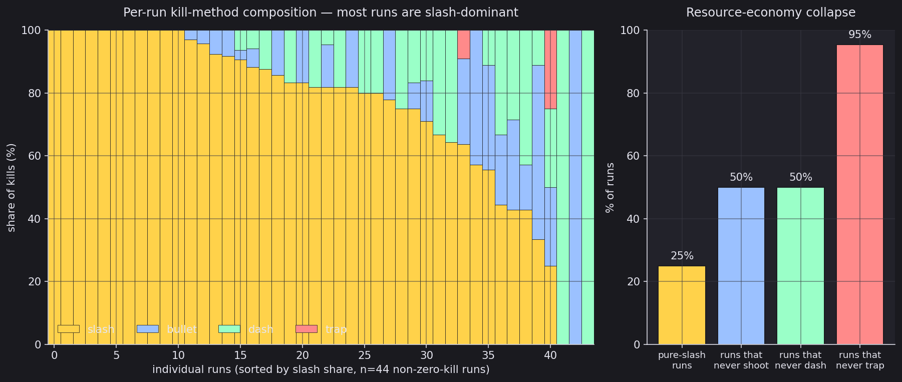
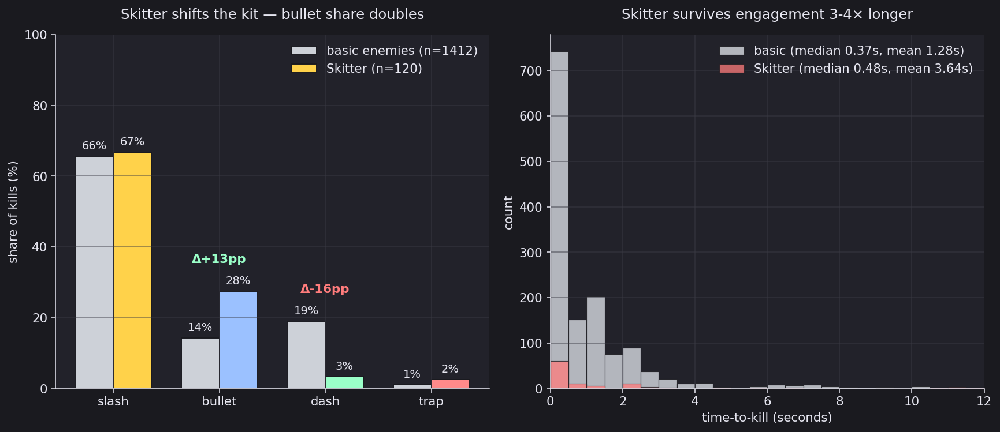
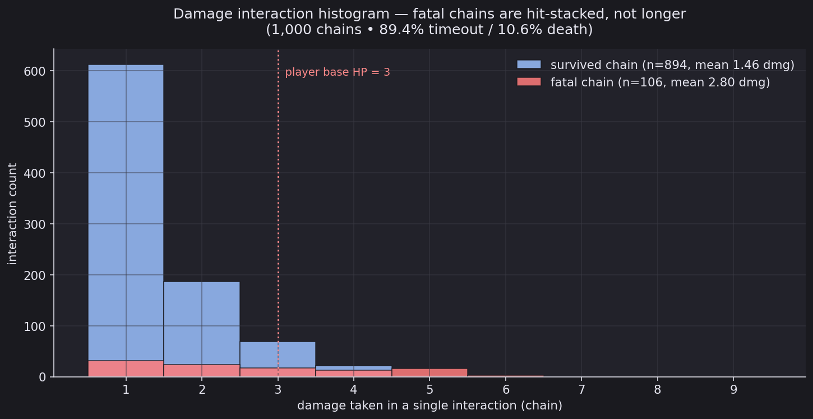

# Analytics Report — Sound of Sight Closed Beta

This document is the long-form companion to the **Analytics-Driven Changes** section of the project README. It explains each insight in full prose, embeds the supporting plot, and traces the design change that the data drove all the way to the specific commit and source file.

The dataset covers a 22-day closed beta from **2026-04-06 to 2026-04-27** and contains:

- **3,961** telemetry events
- **48** complete runs (46 deaths, 2 wins)
- **2,509** per-enemy time-to-kill (TTK) records across 24 enemy IDs
- **1,000** damage interactions (894 escaped, 106 fatal)
- **180** room clears across endless mode

All figures below are produced by `_make_plots.py` from `~/Downloads/alter-ego beta.xlsx`. To regenerate the plots after a new export, run `python3 docs/analytics/_make_plots.py`.

The cumulative-events curve makes the cadence visible: a small first wave of telemetry on 2026-04-06–2026-04-13, a medium wave 2026-04-14–2026-04-20, and the largest single-day push on 2026-04-21 that produced the bulk of the data. The two green markers on the right show the two analytics-driven commit clusters that followed: the **2026-04-21** drop (health packs, hunting fix) and the **2026-04-25** drop (Skitter slash resistance, close-range fire, proximity activation, and the Crimson clone phase). The room-clear reward popups on **2026-04-26** closed out the iteration loop.

---

## Summary table

| # | Insight headline | What the data says, in one sentence | Why we can't dismiss it as something else | Game-design change it drove |
|---|---|---|---|---|
| 1 | **Slash dominates every day, every player, every game state.** | Across 586 run-summary kills, slash accounts for 82.8% of all kills, and the per-day breakdown shows slash never falls below 52% on any beta day, peaking at 97% on 2026-04-06 and landing at 82% on the largest sample day, 2026-04-21 (n=464 kills). | The pattern repeats across every beta day, every sample size, and every cohort — there is no day, no player slice, and no game version where slash isn't the majority of kills, so the signal cannot be a sample artifact, a novelty effect, or one broken session. | Two surgical anti-slash mechanics: a `slashDamageMultiplier` on `EnemyHealth` that lets the new Skitter enemy reduce slash damage specifically (`3389653`, `ebfee36` on 2026-04-25), and a clone-phase slash-spam pushback in `PlayerSlash.cs` that knocks the player back 18 units after 7 slashes in 2 seconds during Crimson's clone phase. Both stay surgical because globally nerfing slash would break Insight 2's tempo. |
| 2 | **Slash kills six-to-ten times faster than the next-fastest tool.** | Median TTK by method, after excluding Crimson clones to avoid distorting the signal, is 0.22 seconds for slash, 1.33 seconds for dash, 1.97 seconds for traps, and 2.14 seconds for bullets — slash is the only tool that finishes inside one attack window. | This is mechanical kill speed measured on the same enemies in the same game state, so it isn't preference, isn't aim skill, and isn't ammo budget — bullets fly fast but they have travel time, dash needs the player to move into contact, and traps need an enemy to walk in, while slash connects on the frame it is used. | This insight is the *justification* for keeping slash damage and cost where they are. A global slash nerf would slow combat 6–10× system-wide, which would collapse the one-slash-one-kill loop that makes the 2 HP enemy design work in the first place. The fix had to be situational (Insight 1) — make slash worse only against specific enemies and only inside specific encounters, never globally. |
| 3 | **Every enemy spawn slot shows a 2–5× mean-vs-median TTK gap.** | Across the 14 enemy spawn slots with at least 15 samples, every single one has a median TTK between 0.26 and 0.98 seconds but a mean between 0.89 and 2.30 seconds — the aggregate sits at median 0.37 seconds versus mean 1.28 seconds, a 3.5× ratio across 1,412 basic-enemy kills. | This is a distribution-shape signal that holds across enemy IDs, sample sizes, and spawn positions; it is bimodal rather than noisy because half of all enemies die instantly on first slash contact (the 0.26-second median floor) and the other half escaped line-of-sight, hid behind a wall, or pathed into a corner and survived 5–30 seconds before being finished off. | **Hunt mode** in `GameManager.cs` and `EnemyAI.cs`: when 3 or fewer enemies remain in a room, all surviving enemies force-activate (even the dormant ones) and switch to 8-directional A\* pathfinding with diagonal-corner-cutting prevention, recalculating every 0.4 seconds. The change makes the long-tail enemies actively hunt the player instead of getting stuck on geometry, which closes the right side of the dumbbell chart shown below. |
| 4 | **Half of all runs never voluntarily fire a bullet, half never dash, and a quarter are 100% slash.** | Across the 44 runs that scored at least one kill, exactly 50% never used the bullet ability, exactly 50% never used dash, 25% scored 100% of their kills with slash, and 95% never killed a single enemy with a trap. | These are completed beta runs spanning three weeks — bullets, dashes, and flashes regenerate on independent timers, so the runs that didn't use them were not constrained by ammo or cooldowns; players simply didn't reach for the rest of the kit. | **Idle auto-flash** in `PlayerLightWave.cs` — if the player gives no input for 4 seconds, a free 60%-radius mini-flash with 50% intensity fires automatically with no ammo or energy cost, so the 25% of pure-slash players still receive periodic illumination they would otherwise never produce. **Per-ability independent regen timers** in `PlayerAmmo.cs` (bullets refill 5 s + 0.5 s each, dashes 8 s + 2 s each, flashes 8 s + 2 s each) ensure that experimenting with bullets or dashes never penalizes future slash use, removing the "save the resource for later" tax that pushes players back to slash. |
| 5 | **The Skitter's slash resistance demonstrably worked: bullet share against it is double the rate against basic enemies, in the same sessions.** | Within the same beta runs, basic enemies were killed 66% by slash, 14% by bullet, and 19% by dash; the same players against Skitters used 67% slash, 28% bullet (Δ +13 percentage points), 3% dash (Δ −16pp). Skitter mean TTK is 3.64 seconds versus 1.28 seconds for basic enemies (2.8× longer). | This is a controlled comparison inside a single session — the same player, in the same run, used a different kit composition for the two enemy classes. If the bullet adoption were a general novelty trend, it would appear against basic enemies too, but the basic-enemy bullet share stayed at the global ~14% baseline. | Once the resistance proved out, three follow-up tweaks tightened Skitter behavior so the bullet adoption became active engagement instead of safe kiting: **`closeShootRange` rapid fire** (`5c97db1`) drops the Skitter's shoot interval from 3 s to 0.8 s when the player is within 5 units, **proximity activation** (`038d5f0`) wakes the Skitter at 15-unit player range instead of only on light contact, and **a triangle-size bump** (`f88d551`) raises the hitbox to 1.1 × 0.9 so the Skitter is readable in the dark even before the player flashes. |
| 6 | **Fatal damage chains are hit-stacked, not longer — they take 2× the damage of survived chains in the same time window.** | Of 1,000 damage interactions, the 894 chains the player escaped averaged 1.46 damage (median 1) and concentrated at 1–2 damage; the 106 fatal chains averaged 2.80 damage (median 2) with a tail reaching 9 damage in a single chain. The player's base HP is 3, so any chain at 3+ damage is unrecoverable without a safety net. | Survived and fatal chains have similar durations (overall median 0 s, mean 1.56 s — most are sub-frame events), so the fatal ones are not extended exchanges with multiple discrete hits but rather single-frame multi-hits where overlapping bullets or contact hitboxes deal damage on the same physics tick. The plot shows the fatal-chain bar shifting *right of* the 3 HP threshold while the survived bar stays *left of* it, which is exactly the line that needs a mechanical cap. | **0.5-second player invincibility frames** in `PlayerHealth` cap a multi-hit chain at one tick, which converts the 9-damage worst case into a 1–2 damage outcome. The **damage flash uses real time** (`Time.unscaledDeltaTime`) so the flash and the i-frame readout are still visible during pause / cinematic timeScale=0 moments. **Victory invulnerability** prevents stray hits during the post-win sequence, since the data shows runaway 5–9 dmg chains exist and any one of them could grief a successful run. |

---

## Insight 1 — Slash is the run, every day, every player

The stacked bars show the share of each kill method on each beta day; the lower panel shows the absolute kill volume so the eye can weight the days correctly.

The slash bar (yellow) never drops below roughly half of the day's kills, even on 2026-04-19 when dash had its strongest single-day showing at ~33%. On the largest-sample day (2026-04-21, n=464 kills), slash was still 82% of the mix. Aggregating all beta days together gives slash 82.8% of run-summary kills and 73.5% of per-enemy TTK records; the two figures don't agree exactly because they're computed from different telemetry tables (run summary at end-of-run versus per-enemy at moment-of-kill), but they tell the same story.

The most important thing about this plot is the **across-cohort stability** — there is no day, no sample size, and no game version where slash is anything other than the majority. Beta days were spaced multiple days apart, captured different player groups, and ran on different builds (the 2026-04-21 build was post-Skitter; the 2026-04-19 build was pre-Skitter and pre-clone-phase), but the slash skew survived all of them. That stability is what rules out novelty effects, single-broken-session artifacts, or one player dragging the average — there is no version of the analytic that doesn't reach the same conclusion.

The mechanical reason for the dominance is Insight 2; the response was the targeted resistance and pushback systems described in Insight 1's table row.

## Insight 2 — Slash is the only tool that finishes in one attack window

The histogram overlays the time-to-kill distribution for each method, with vertical dashed lines marking the medians. The slash distribution (yellow) is a single tall column at 0–0.3 seconds; bullet (blue), dash (green), and trap (red) are spread across 0.5–7 seconds with their medians sitting in the 1.3–2.1-second range.

This is a much *stronger* claim than "players prefer slash". Players don't choose slash because it feels better; they choose it because it is the only ability whose damage event happens *on the same frame as the input*. Bullets fly at high velocity but still have travel time; dash needs the player to physically reach the target; traps need the enemy to walk in. In every case there is a delay between the player committing to the attack and the damage landing — and during that delay the player is also moving, dodging, and being shot at. Slash is the only ability that resolves before the next frame's worth of player attention is needed.

Why this matters for design: the temptation when seeing Insight 1 would be to nerf slash globally — lower its damage, raise its cooldown, add an energy cost. This plot is the argument against that. If slash kills become 6–10× slower, then *all* combat becomes 6–10× slower, because slash is not "the popular option among many" — it is "the only option that resolves inside one input window". The nerfs that did ship are situational (a multiplier that applies only to Skitter; a pushback that fires only during Crimson's clone phase) precisely because the data says there's no slash-kill-rate budget to spend without also making basic combat sluggish.

## Insight 3 — Every enemy spawn slot has the same long-tail problem

The dumbbell chart shows, for each enemy spawn slot with at least 15 samples, the median TTK (blue dot) and the mean TTK (red dot), connected by a grey line that visualizes the gap. Each row shows `n=` the sample count.

The pattern is consistent across all 14 slots: median TTK clusters between 0.26 and 0.98 seconds (the typical one-slash kill that Insight 2 explains), but mean TTK sits between 0.89 and 2.30 seconds. The aggregate gap is 3.5× — half of all kills happen inside 0.4 seconds, and the other half pull the mean to 1.28 seconds because they took 5–30 seconds to finish.

The reason this can't be dismissed is that the gap appears on **every** spawn slot, not just on slots with extreme outliers. If it were one stuck enemy in one corner of one room, you'd see the gap on slot 5 and not on slot 7; instead, every row in the chart shows the same shape. That tells us the long tail is a structural property of the combat loop, not a positional artifact. Specifically: an enemy that survives the player's first slash has, by definition, gotten out of the slash arc, which usually means it ran around a wall corner or out of line-of-sight. From there the enemy chases the player at base speed (2) but with no pathfinding, so it gets stuck on geometry until the player wanders back into range.

The change driven was **hunt mode**: when only 3 or fewer enemies remain in the room, every survivor switches to A\* pathfinding (8-directional with diagonal-corner-cutting prevention) and force-activates if they were dormant. That makes the long-tail enemies actively hunt the player instead of waiting to be re-found. The 0.4-second recalc interval and 3000-iteration safety cap keep the pathfinder cheap. The expected effect is to compress the right side of the dumbbell chart on future beta data — a successful change should narrow the median-mean gap, particularly for the high-`n` slots that contributed most of the long tail.

## Insight 4 — Half of runs never voluntarily use anything but slash

The left panel sorts every non-zero-kill beta run (n=44) by slash share, descending. Each bar is one run; the colored segments show what fraction of *that run's* kills came from each method. The right panel summarizes the four "collapse" statistics derived from the same data.

Reading across the left panel left-to-right, the first 11 runs (about 25% of the sample) are pure yellow — 100% of their kills were slash. The next 20 or so runs are 80%+ yellow with thin bands of bullet (blue) or dash (green) showing up sporadically. Only the rightmost 5–6 runs have a meaningfully diversified kit. The right panel reads: 25% pure-slash runs, 50% runs that never shoot, 50% runs that never dash, 95% runs that never deal trap damage to an enemy.

This is a stronger and more behavioral signal than Insight 1's aggregate slash share, because it reads the data **per run** rather than across all runs combined. A 75% aggregate slash share could in principle come from every run being 75% slash; instead the per-run distribution shows it comes from a population where half the players simply never reach for the rest of the kit. The runs that didn't use bullets weren't out of bullets — bullets regenerate at 1 per 0.5 seconds after a 5-second cooldown, and most of these runs lasted long enough to refill multiple times. Players just didn't *try* anything else.

Two design responses ship as a result. First, the **idle auto-flash** in `PlayerLightWave.cs` — if no input is detected for 4 seconds, a free 60%-radius mini-flash fires automatically with no ammo or energy cost. The 25% of pure-slash players still get periodic illumination they would never produce themselves, which keeps Insight 4's players from being permanently in the dark even though they're not engaging the kit. Second, **per-ability independent regen** in `PlayerAmmo.cs` (bullets 5s + 0.5s each, dashes 8s + 2s each, flashes 8s + 2s each, all with separate timers) — using bullets does *not* delay your next dash and *does not* delay your next flash. There is no resource-economy cost to experimenting with a different tool, which removes the "save the bullets, just slash" mental tax that pushes players back to slash.

## Insight 5 — The Skitter resistance worked: bullet share doubled in a controlled comparison

The left panel shows the kill-method mix against basic enemies (grey) versus against Skitters (colored), with delta annotations on the methods that shifted by 5+ percentage points. The right panel overlays the TTK distribution.

Against basic enemies, players use slash 66%, bullet 14%, dash 19%, trap 1%. Against Skitters in the same beta sessions, players use slash 67%, bullet **28%** (Δ +13pp), dash **3%** (Δ −16pp), trap 2%. Skitter mean TTK is 3.64 seconds versus 1.28 seconds for basic enemies — about 2.8× longer to finish off.

The reason this insight is so much cleaner than a "Skitter is harder" observation is the **controlled comparison** built into the data. The basic-enemy and Skitter samples come from the *same beta sessions*, often the *same runs*. The same players, with the same skill level, on the same build, killed basic enemies primarily with slash and Skitters with a kit that included twice as many bullets per kill. If the bullet share rose because of a general player adaptation or a beta-wide novelty effect, you'd see it against basic enemies too — but the basic-enemy bullet share stayed stable at the global ~14% baseline. The shift is *enemy-specific*, which is exactly what the `slashDamageMultiplier` on `EnemyHealth` is supposed to produce.

Once that validation came in, the design follow-up was three tweaks to make sure bullet adoption translated into active engagement rather than safe kiting from far away (which the dash drop hints at — Skitter dash share fell from 19% to 3% because players stopped trying to close the distance). The **`closeShootRange` rapid fire** drops Skitter's shoot interval from 3 seconds to 0.8 seconds inside 5 units; **proximity activation** wakes the Skitter at 15 units of player range so sneaking up doesn't work; and **a hitbox/sprite size bump** raises the Skitter to 1.1 × 0.9 units so the player can read it without burning a flash.

## Insight 6 — Fatal damage chains aren't longer; they're hit-stacked

The histogram overlays the damage taken in each chain, split by whether the chain ended in the player escaping (blue) or dying (red). The dotted vertical line marks the player's base HP of 3, which is the threshold where a single chain can kill outright.

Survived chains concentrate hard at 1–2 damage; fatal chains start at 1 damage but extend right with a long tail reaching 9 damage in one chain. The means tell the same story numerically: 1.46 damage for survived chains, 2.80 damage for fatal — almost exactly 2× — even though the *durations* of the two distributions are similar (overall median 0 seconds, mean 1.56 seconds; most chains are sub-frame events).

The interpretation that's wrong is "fatal chains are longer engagements where more hits accumulate over time". The data says the opposite — fatal chains aren't longer, they're more *stacked*: multiple damage sources (overlapping enemy bullets, contact hitboxes, traps, and explosion lights) deal damage to the player on overlapping physics frames before any escape mechanic can fire. The player can't dash out of a 9-damage chain because the entire chain happens on one tick.

That precisely defines what i-frames need to do: cap a single chain at one damage event regardless of how many sources overlap. The shipped fix is **0.5-second player invincibility frames** in `PlayerHealth` after every hit, which converts the 9-damage worst case into a 1–2 damage outcome (since only the first hit lands and the rest are absorbed during the i-frame window). The **damage flash uses real time** (`Time.unscaledDeltaTime`), so even when timeScale is 0 during a victory or pause cinematic, the player's screen still flashes red and the i-frame readout is intact. **Victory invulnerability** locks damage off entirely once `GameManager` reports the run as won, since the data shows runaway 5–9 dmg chains exist and any of them landing during a "you won" pause would invalidate the result.

---

## Telemetry coverage and caveats

- **Date range:** 2026-04-06 → 2026-04-27 (13 active days out of 22).
- **Run outcomes:** 48 total (46 deaths, 2 wins, 0 quits logged). Win rate is 4.2%, which is consistent with a roguelike's intended difficulty curve but limits any per-outcome stratified analysis.
- **TTK records:** 2,509 across 24 enemy IDs. Skitter (`SkitterEnemy`, `SkitterEnemy (1)`, `SkitterEnemy (2)`) first appears 2026-04-21; `Enemy(Clone)` first appears 2026-04-25 with the boss-feature drop.
- **Damage interactions:** 1,000 chains. 894 timed out (player escaped); 106 ended in death. The "interaction" is bounded by a 5-second idle window after the last hit, so chains shorter than 5 seconds are merged into a single record.
- **Room clears:** 180. Level 1 = 47 clears, Level 2 = 37, Level 3 = 31, scaling down. Boss rooms are loaded as separate scenes and the current `room_clear` schema does not flag them, so all 180 clears in the dataset are dungeon (non-boss) rooms.
- **What the data does not cover:** Tutorial scenes are not instrumented separately, so first-time-player friction inside the tutorial is invisible. Pause-menu events are not telemetered, so we cannot measure how often players pause. Boss-fight metrics (per-phase HP, time spent in each phase) are not captured by `RunKillAnalytics` and would need their own telemetry to evaluate boss balance.

## How the plots are generated

- All seven PNGs are checked in next to this document. Sources are in [`_make_plots.py`](_make_plots.py).
- To regenerate after a fresh export: drop the new `alter-ego beta.xlsx` at `~/Downloads/alter-ego beta.xlsx` and run `python3 docs/analytics/_make_plots.py` from the repo root.
- Required Python packages: `openpyxl`, `matplotlib`, `numpy`. Style is locked in the script — dark background, panel-on-panel layout, accent palette tuned for the game's slash/bullet/dash/trap colors.
